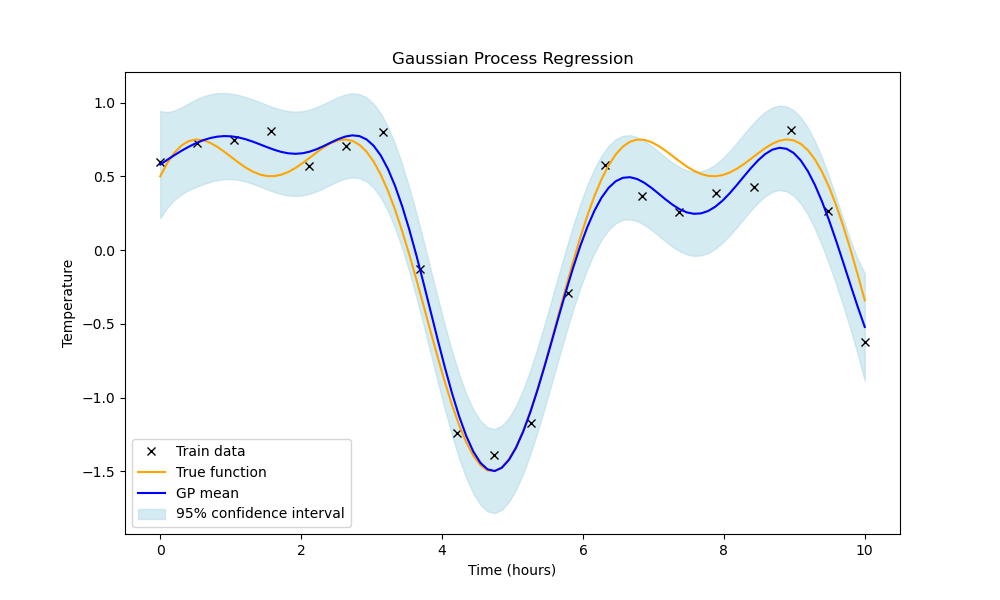
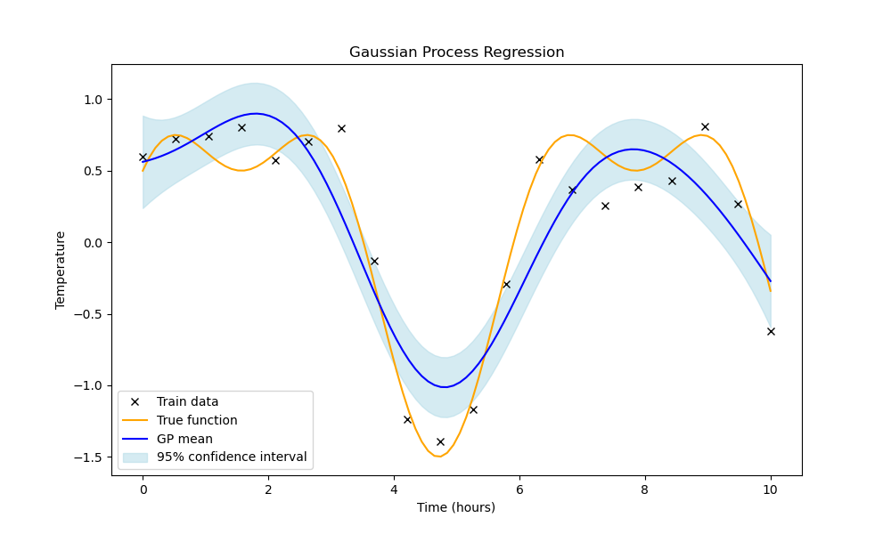
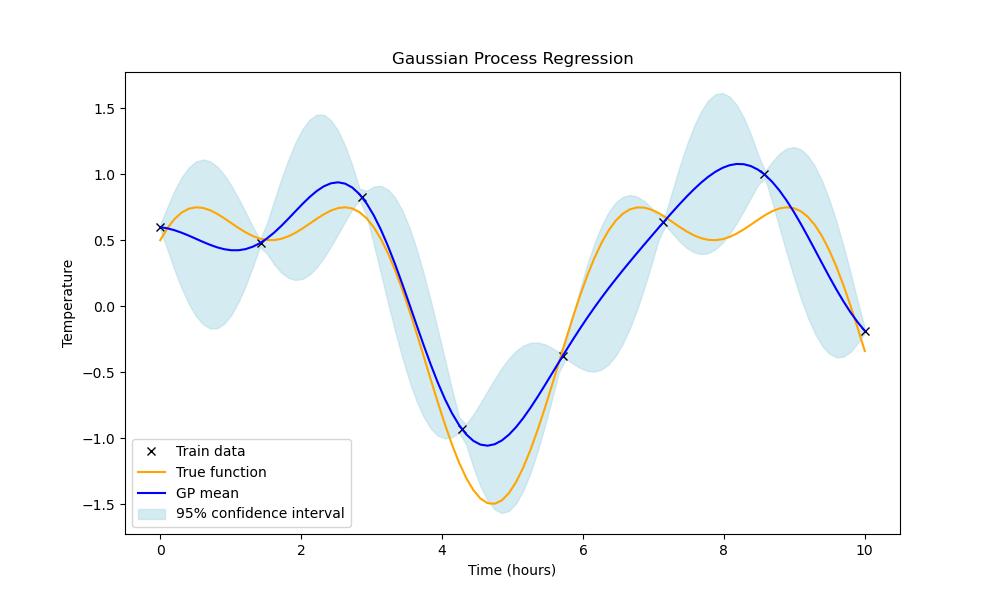
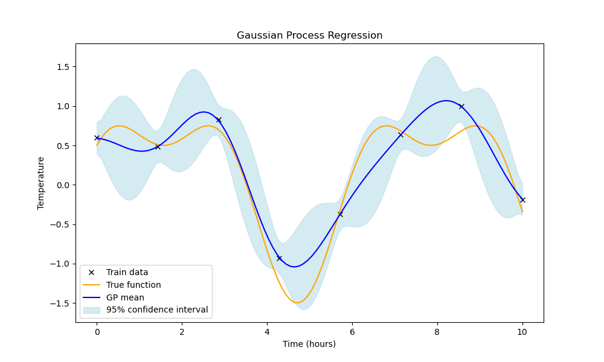

# Gaussian Processes: A Complete Guide

Over the past week, I’ve dedicated nearly 2 hours each day to deeply understand Gaussian Processes (GPs) — not just how to apply them, but to build an intuitive grasp of every term in the formula. This guide is a reflection of that effort, written to help others who, like me, are starting with just a basic understanding of random variables — especially Gaussian random variables.

I am currently a first-year online degree student, and all my learnings are a result of self-study from various books, research papers, and online resources. My goal is to make this topic more approachable by breaking down not just the what, but also the why behind the formulas.

Whether you’re completely new to Gaussian Processes or revisiting the concept, I’d be grateful for your feedback and reviews. Constructive input from learners and mentors alike helps refine this work and deepen my understanding.

📬 If you found this guide useful or would like to discuss further or believe we might inspire or support each other's growth, I warmly invite you to connect with me on LinkedIn — let's learn and grow together!
[LinkedIn prodile](https://www.linkedin.com/in/komil-parmar-488967243/)

If you prefer email, mail me at one of the following:
- komilparmar57@gmail.com
- komil.parmar@op.iitg.ac.in

## Table of Contents
1. [Introduction: Why Random Variables Matter](#introduction)
2. [The Gaussian Process Assumption](#assumption)
3. [Understanding Joint Multivariate Normal Distribution](#joint-distribution)
4. [Kernel Functions](#kernel-functions)
5. [Kernel Matrix](#kernel-matrix)
6. [Parameter Estimation: Mean and Covariance](#parameter-estimation)
7. [Mathematical Formulation](#mathematical-formulation)
8. [Understanding K⁻¹ (Kernel Matrix Inverse)](#kernel-inverse)
9. [Practical Implementation](#implementation)

---

## Introduction: Why Random Variables Matter {#introduction}

How does knowing the random variable help?

-> Scenario 1:
Imagine that there are two classes Class A and Class B and I have the data of the hours of study and the results of the students belonging to each class. Let's say I give you the data belonging to Class A and a new data point of a student belonging to an unknown class. You are supposed to find if the given student belongs to Class A or not. 
You will not be able to answer this directly without using any learning algorithm. 

However if I assure you that the data follows a multivariate normal distribution and I give you the parameters of this distribution then you can easily estimate the probability of the new data point belonging to this normal distribution and hence the probability that it belongs to class A.

-> Scenario 2:
Now let's say that you are supposed to find the result given the hours of study for the new student given that the new student is from class A. To do this let's say that the hours of study and the result are individually normally distributed.

**Key Insight:** Proof says that if one normal distribution is conditioned on another normal distribution then the resulting distribution is still a normal distribution.

All that is left to do is to find the parameters of this conditioned normal distribution that are the mean and the covariance matrix in order to find out the result given the hours of study. This is exactly what Gaussian processes do.

---

## The Gaussian Process Assumption {#assumption}

However it is extremely rare that the given data and the corresponding target variable are both individually Gaussian distributed. This is where the assumption of the Gaussian process comes into play.

In Gaussian process we instead assume that there exists some unknown function (that we do not need to care about) that on applying which to any subset of the data points X and the corresponding target values y will create a new set of elements $f(x_1), f(x_2),\ldots, f(x_n)$ that are jointly (it means together) multivariate normally distributed and so are $f(y_1), f(y_2), \ldots, f(y_n)$.

So now the parameters that we have to find or estimate are of the joint conditional distribution (not the ones of individual distributions).

The joint conditional distribution is $[f(y_1), f(y_2),\ldots, f(y_n)] \mid [f(x_1), f(x_2),\ldots, f(x_n)]$

This is not a set of separate distributions like $[f(y_1) \mid f(x_1)], [f(y_2) \mid f(x_2)], \ldots$ etc. Instead, it's a multivariate normal distribution for all the new points together, conditioned on all the observed data.

---

## Understanding Joint Multivariate Normal Distribution {#joint-distribution}

### What does jointly (together) multivariate normally distributed mean?

It means that these data points can be sampled from the same multivariate (or simply multi-dimensional) normal distribution. 

Also, if there are n transformed data points that we are considering, then this multivariate normal distribution that we are talking about will be n-dimensional. 

**Important Note:** $n$ is not the dimension of the values/vectors ($d$) in $X$. Hence, this multivariate normal distribution is not a distribution over our samples but a distribution over the functions that are eligible for the setup explained before. And just like normally a normal distribution tells us how likely a value is, this multivariate normal distribution is going to tell us how likely each eligible function is.

### If you are still not convinced why is it n-dimensional?

If we select $n$ data points then the multivariate normal distribution is going to be $n$ dimensional. This is because for every possible sample that we extract from it, that as we know is a function, is going to generate a $f(?)$ for each of the data points that we considered.

---

## Kernel Functions {#kernel-functions}

### What is a kernel function?

A kernel is a function that takes in two points as input and gives a big value if the two points are close to each other and a small value if the two points are far from each other. So, in a way it is kind of the inverse of some distance metric like L1 or L2.

The kernel measures how similar $x$ and $x'$ are, and the Gaussian Process uses this to make sure that $f(x)$ and $f(x')$ are just as similar (or different).

So, if two points are close together and the kernel says they're very similar, the GP expects their function values to be close too. If they're far apart, the kernel says they're less similar, and the function values can be more different. This helps to filter or make a selection of which function should be used.

### Common Kernel Functions

**Radial Basis Function (RBF) / Gaussian Kernel:**
$$k(x, x') = \sigma^2 \exp\left(-\frac{\|x - x'\|^2}{2l^2}\right)$$

**Linear Kernel:**
$$k(x, x') = \sigma^2 (x \cdot x')$$

**Polynomial Kernel:**
$$k(x, x') = (x \cdot x' + c)^d$$

---

## Kernel Matrix {#kernel-matrix}

### What is a kernel matrix?

We make a kernel matrix where each entry $(i,j)$ is the output of the kernel when the inputs are the $i$-th and $j$-th data points.

**Note:** Most of the kernel functions are symmetrical just like most of the distance metrics. And hence, the kernel matrix will most probably be a symmetric matrix.

Then, we use this kernel matrix as the covariance matrix of the multivariate gaussian distribution (over X).

### Why is the covariance matrix to be replaced by the kernel matrix?

Any entry $(i, j)$ in the covariance matrix tells us how much the variable at $i$ is going to vary with respect to the variable at $j$. Hence, if we replace it with the kernel matrix then it means that the variables that are closer to each other are going to influence each other's values more as compared to the variables that are far from each other.

### Practical Example

Imagine the hours of study (h.o.s.) of 2 students are 4 and 8 and the results are 60% and 90% respectively. If a new student's hours of study is 7 hours will the result be closer to 60% or 90%? Definitely closer to the result of that student whose h.o.s. are close to this new student's h.o.s. right!

However, if the h.o.s. of the new student was instead 8.5 hours, how could we say if the result will be 100% or 95%? The result of the student with h.o.s. 4 is going to help us with this even though the influence will be smaller. Hence, we now need some way to describe how slow or how fast the influence is going to drop?

### Length-Scale Parameter

In many of the kernel functions, we already have a length-scale or ($l$-parameter) that defines how fast the influence (value of kernel) is going to drop with increasing distance. Kind of like the width of the gaussian distribution.

- If the value of this parameter is too low then for 7 h.o.s. we would have estimated result of $\geq 85\%$.
- And, if the value of this parameter is too high then we would have estimated the same result as $\sim 75\%$ ($\sim$ average of 60 and 90)

    
    

On the left we have used a length scale of 1.0 while on the right we have used a length scale of 2.0. As a result of which, can you see on the right graph that the fitted function is way more smooth than on the left. 

Besides the length-scale, Gaussian processes often add a "noise variance" term to the kernel. This lets the model know that some of the variation in the data is just noise, so it doesn't try to fit every point exactly. The exact need of this will be covered later in the section on parameter estimation.

---

## Understanding K⁻¹ (Kernel Matrix Inverse) {#kernel-inverse}

### What does $K^{-1}$ mean?

$K^{-1}$ is the inverse of the kernel matrix $K(X,X)$. But what does this represent conceptually?

$K K^{-1}$ untangles the relationships encoded in $K$. It allows us to "undo" the kernel's influence, isolating the contributions of individual training points. 

### Mathematical Properties

1. $K(X,X)$ is an $n \times n$ symmetric, positive semi-definite matrix
2. $K^{-1}$ exists when $K$ is positive definite (non-singular)
3. $K K^{-1} = I$ (identity matrix)

### Fun Example:
Imagine you're asking three friends what the weather is like. Two friends are standing together and say, "It's sunny!" The third friend is far away and says, "It's cloudy!" If you just count all three answers, you might think "sunny" is more likely. But since two friends are together, their answers are almost the same. The inverse kernel helps you realize you really only have two different opinions, not three.

### Matrix Example: Highly Correlated Points

Let's create a concrete example with a 3×3 kernel matrix where two training points are highly correlated:

$$
K = \begin{bmatrix}
1.0 & 0.9 & 0.1 \\
0.9 & 1.0 & 0.1 \\
0.1 & 0.1 & 1.0
\end{bmatrix}
$$

Here:
- Points 1 and 2 are highly similar (kernel value = 0.9)
- Point 3 is distant from both (kernel value = 0.1)
- Diagonal entries are 1.0 (each point is identical to itself)

**Inverse Kernel Matrix K⁻¹:**

$$
K^{-1} = \begin{bmatrix}
5.26 & -4.74 & 0.53 \\
-4.74 & 5.26 & 0.53 \\
0.53 & 0.53 & 1.05
\end{bmatrix}
$$

**What's Happening:**
1. **Original Correlation**: Points 1 and 2 had high similarity (0.9), meaning they provide redundant information
2. **Inverse Correction**: 
   - The inverse has **negative values** (-4.74) between points 1 and 2
   - This negative correlation **reduces** the combined influence of these redundant points
   - Point 3 maintains positive, moderate weights (0.53, 1.05)

3. **Practical Impact**: 
   - If we have observations $y = [sunny, sunny, cloudy]^T$
   - Without correction: All three votes count equally
   - With $K^{-1}$: The two "sunny" votes partially cancel each other out due to redundancy
   - The "cloudy" vote gets appropriate weight for being independent information

**Mathematical Intuition:**
The negative off-diagonal terms in $K^{-1}$ act as a "redundancy penalty" - they prevent double-counting of similar information, ensuring that highly correlated training points don't unfairly dominate the prediction.

### Think what would happen if two points were exactly the same?
If two points were exactly the same, the kernel matrix would have a zero determinant, making it singular. In this case, $K^{-1}$ would not exist, and we couldn't compute predictions. This is why we often add a small noise term to ensure numerical stability.

### Numerical Stability

To ensure $K^{-1}$ exists and is numerically stable, we often add a small noise term:

$$K_{\text{regularized}} = K + \sigma^2 I$$

Where $\sigma^2$ is the noise variance and $I$ is the identity matrix.

    
    

On the left you can see the Gaussian Process without adding the noise term and on the right you can see the Gaussian Process after adding the noise term.
Observe that where we have the training points, the left graph without the noise term is too confident and tries to fit the training points exactly, while the right graph with the noise term is more smooth and realistic, acknowledging that there is some uncertainty in the training data.

---

## Parameter Estimation: Mean and Covariance {#parameter-estimation}

Now let's proceed to the final part. That is estimating the parameter values of the conditional normal distribution.

### What do you think the best estimate of the target variable should be?
If we have a new test point $x_*$, the best estimate of the target variable $y_*$ should be the weighted average of the observed target values $y$ from the training data, where the weights are determined by how similar $x_*$ is to each training point.
But this would lead to redundant information being counted multiple times as we saw in the previous section. So, we need to use the inverse of the kernel matrix to ensure that we do not double count the information.

Hence, instead of directly multiplying the kernel values with the target values, we will multiply the kernel values with the inverse of the kernel matrix to get rid of the redundancy and then multiply it with the target values.

### Formula
The best estimate of the **mean** for a new test point $x_*$ given our training data is:

$$\mu(x_*) = K(x_*, X) K(X,X)^{-1} y$$

Where:

- $K(x_*, X)$: A vector of kernel values between the test point $x_*$ and all training points
- $K(X,X)^{-1}$: The inverse of the kernel matrix of training points  
- $y$: The vector of observed target values

### What is the Best Estimate of Covariance?

**What do you think the best estimate of uncertainty should be?**

If we have a new test point $x_*$, our initial uncertainty (before seeing any training data) should be high - we don't know anything about this point. However, as we observe training data points that are similar to $x_*$, our uncertainty should decrease. The more similar the training points are to $x_*$, the more confident we should be in our prediction.

But again, we need to be careful about redundant information. If we have multiple highly correlated training points near $x_*$, we shouldn't let them artificially inflate our confidence. We need to account for the fact that these points provide overlapping information.

Hence, we start with the prior uncertainty $K(x_*, x_*)$ and then subtract the reduction in uncertainty that comes from observing the training data, but we use the inverse kernel matrix to properly weight this reduction and avoid double-counting correlated information.

You can connect this to the idea behind best estimate of the mean, by observing that the weights are still the same but instead of multiplying them with the target (Since we were estimating the target value) values, we will multiply them with the kernel values (Since we are trying to estimate the variance now) of the test point with itself.

The **covariance** (uncertainty) of the prediction at $x_*$ is:

$$\Sigma(x_*) = K(x_*, x_*) - K(x_*, X) K(X,X)^{-1} K(X, x_*)$$

Where:

- $K(x_*, x_*)$: The prior variance at the test point (what we'd expect if we had no training data)
- $K(x_*, X) K(X,X)^{-1} K(X, x_*)$: The reduction in variance due to having observed the training data

The second term represents how much our uncertainty decreases because of the training data. If $x_*$ is very similar to training points, this term will be large, making our prediction more certain (smaller variance).

---

## Mathematical Formulation {#mathematical-formulation}

### Complete Gaussian Process Prediction

For a new test point $x_*$, the predictive distribution is:

$$f_* \mid X, y, x_* \sim \mathcal{N}(\mu(x_*), \Sigma(x_*))$$

Where:
- $\mu(x_*) = K(x_*, X) K(X,X)^{-1} y$ (predictive mean)
- $\Sigma(x_*) = K(x_*, x_*) - K(x_*, X) K(X,X)^{-1} K(X, x_*)$ (predictive variance)

### For Multiple Test Points

For multiple test points $X_*$, the joint predictive distribution is:

$$f_* \mid X, y, X_* \sim \mathcal{N}(\mu_*, \Sigma_*)$$

Where:
- $\mu_* = K(X_*, X) K(X,X)^{-1} y$
- $\Sigma_* = K(X_*, X_*) - K(X_*, X) K(X,X)^{-1} K(X, X_*)$

### Kernel Matrix Notation

- $K(X,X)$: $n \times n$ kernel matrix between all pairs of training points
- $K(X_*, X)$: $m \times n$ kernel matrix between test points and training points  
- $K(X_*, X_*)$: $m \times m$ kernel matrix between all pairs of test points
- $K(x_*, x_*)$: Scalar kernel value of test point with itself

---

## Practical Implementation {#implementation}

### Step-by-Step Algorithm

1. **Choose a Kernel Function**: e.g., RBF kernel with parameters $\sigma^2$ and $l$
2. **Compute Kernel Matrix**: $K(X,X)$ for training data
3. **Add Noise**: $K = K + \sigma_{\text{noise}}^2 I$ for numerical stability
4. **Compute Inverse**: $K^{-1}$ (using Cholesky decomposition)
5. **For New Point $x_*$**:
   - Compute $k_* = K(x_*, X)$
   - Mean: $\mu_* = k_*^T K^{-1} y$
   - Variance: $\sigma_*^2 = K(x_*, x_*) - k_*^T K^{-1} k_*$

### Hyperparameter Learning

The kernel parameters $(\sigma^2, l, \sigma_{\text{noise}}^2)$ are typically learned by maximizing the marginal likelihood:

$$\log p(y|X) = -\frac{1}{2}y^T K^{-1} y - \frac{1}{2}\log|K| - \frac{n}{2}\log(2\pi)$$

I will soon add the optimization code for this.

### Advantages of Gaussian Processes

1. **Uncertainty Quantification**: Provides confidence intervals for predictions
2. **Non-parametric**: Doesn't assume a specific functional form
3. **Bayesian**: Incorporates prior knowledge through kernel choice
4. **Interpolation**: Exact predictions at training points (if no noise)

### Limitations

1. **Computational Complexity**: $O(n^3)$ for training, $O(n)$ for prediction
2. **Kernel Choice**: Performance heavily depends on kernel selection
3. **Scalability**: Difficult to scale to very large datasets without approximations

---

## Conclusion

Gaussian Processes provide a powerful, principled approach to regression and classification problems. By assuming that functions are drawn from a multivariate normal distribution, we can:

1. Make predictions with uncertainty estimates
2. Incorporate prior knowledge through kernel functions
3. Automatically handle regularization through the Bayesian framework

In Machine Learning, they are primarily used for regression tasks and especially bayesian optimization and hyperparameter tuning, where understanding uncertainty is crucial.

The key insight is that the kernel matrix encodes our assumptions about function smoothness and similarity, while the mathematical formulation provides optimal predictions given these assumptions.

The beauty of GPs lies in their ability to provide not just predictions, but also a measure of confidence in those predictions, making them invaluable for decision-making under uncertainty.

📬 If you found this guide useful or would like to discuss further or believe we might inspire or support each other's growth, I warmly invite you to connect with me on LinkedIn — let's learn and grow together!
[LinkedIn profile](https://www.linkedin.com/in/komil-parmar-488967243/)

If you prefer email, mail me at one of the following:
- komilparmar57@gmail.com
- komil.parmar@op.iitg.ac.in
